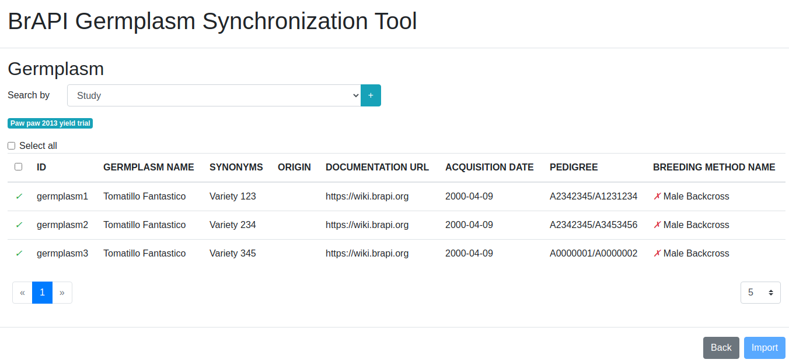
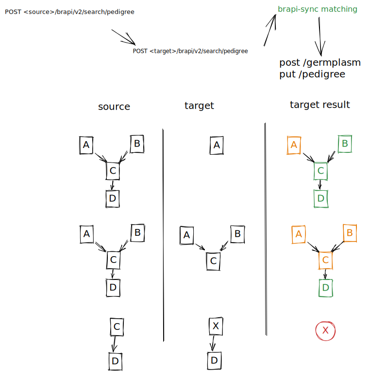

# brapi-sync

A standalone tool to exchange and migrate data between two [BrAPI] enabled database/servers.

This tool can be used to synchronize entities via [BrAPI] standard. This includes:
* Germplasm (option to include ancestors/pedigree tree)
* Trial
* Study
* Observation Units
* Observation Variable
* Observation

This is an alpha version and still under develppment.

## BrAPI V2 services consumed in this tool:
* [GET /programs](https://app.swaggerhub.com/apis/PlantBreedingAPI/BrAPI-Core/2.0#/Programs/get_programs)
* [GET /germplasm](https://app.swaggerhub.com/apis/PlantBreedingAPI/BrAPI-Germplasm/2.0#/Germplasm/get_germplasm)
* [POST /germplasm](https://app.swaggerhub.com/apis/PlantBreedingAPI/BrAPI-Germplasm/2.0#/Germplasm/post_germplasm)
* [GET /locations](https://app.swaggerhub.com/apis/PlantBreedingAPI/BrAPI-Core/2.0#/Locations/get_locations)
* [GET /breedingmethods](https://app.swaggerhub.com/apis/PlantBreedingAPI/BrAPI-Germplasm/2.0#/Germplasm/get_breedingmethods)
* [GET /trials](https://app.swaggerhub.com/apis/PlantBreedingAPI/BrAPI-Core/2.0#/Trials/get_trials)
* [POST /trials](https://app.swaggerhub.com/apis/PlantBreedingAPI/BrAPI-Core/2.0#/Trials/post_trials)
* [GET /studies](https://app.swaggerhub.com/apis/PlantBreedingAPI/BrAPI-Core/2.0#/Studies/get_studies)
* [GET /studies/{studyDbId}](https://app.swaggerhub.com/apis/PlantBreedingAPI/BrAPI-Core/2.0#/Studies/get_studies__studyDbId_)
* [POST /studies](https://app.swaggerhub.com/apis/PlantBreedingAPI/BrAPI-Core/2.0#/Studies/post_studies)
* [GET /search/observationunits/{searchResultsDbId}](https://app.swaggerhub.com/apis/PlantBreedingAPI/BrAPI-Phenotyping/2.0#/Observation%20Units/get_search_observationunits__searchResultsDbId_)
* [POST /search/observationunits](https://app.swaggerhub.com/apis/PlantBreedingAPI/BrAPI-Phenotyping/2.0#/Observation%20Units/post_search_observationunits)
* [POST /observationunits](https://app.swaggerhub.com/apis/PlantBreedingAPI/BrAPI-Phenotyping/2.0#/Observation%20Units/post_observationunits)
* [GET /search/variables/{searchResultsDbId}](https://app.swaggerhub.com/apis/PlantBreedingAPI/BrAPI-Phenotyping/2.0#/Observation%20Variables/get_search_variables__searchResultsDbId_)
* [POST /search/variables](https://app.swaggerhub.com/apis/PlantBreedingAPI/BrAPI-Phenotyping/2.0#/Observation%20Variables/post_search_variables)
* [PUT /studies/{studyDbId}](https://app.swaggerhub.com/apis/PlantBreedingAPI/BrAPI-Core/2.1#/Studies/put_studies__studyDbId_)
* [GET /observations](https://app.swaggerhub.com/apis/PlantBreedingAPI/BrAPI-Phenotyping/2.0#/Observations/get_observations)
* [POST /observations](https://app.swaggerhub.com/apis/PlantBreedingAPI/BrAPI-Phenotyping/2.0#/Observations/post_observations)
* [GET /search/pedigree/{searchResultsDbId}](https://app.swaggerhub.com/apis/PlantBreedingAPI/BrAPI-Germplasm/2.1#/Pedigree/get_search_pedigree__searchResultsDbId_)
* [POST /search/pedigree](https://app.swaggerhub.com/apis/PlantBreedingAPI/BrAPI-Germplasm/2.1#/Pedigree/post_search_pedigree)
* [PUT /pedigree](https://app.swaggerhub.com/apis/PlantBreedingAPI/BrAPI-Germplasm/2.1#/Pedigree/put_pedigree)



## How it works

Using brapi v2 endpoints, it retrieves/filter entities from one server and push them to a target server.
To keep track of submitted entities it adds another entry into the externalReferences field:

```json
{
    "externalReferences": [
        // copied from source germplasm
        {
            "referenceID": "doi:10.155454/12341234",
            "referenceSource": "DOI"
        },
        {
            "referenceID": "http://purl.obolibrary.org/obo/ro.owl",
            "referenceSource": "OBO Library"
        },
        {
            "referenceID": "75a50e76",
            "referenceSource": "Remote Data Collection Upload Tool"
        },
        // added by the brapp on submission  
        {
            "referenceID": "https://www.bms-uat-test.net/bmsapi/maize/brapi/v2/germplasm/3304",
            "referenceSource": "brapi-sync"
        }
    ]
}
```

## Two-way observations sync

If the user wants to import observations from a target which was previously imported via brapi-sync, the target study won't be found searching by external reference 
because it's the original study and it doesn't have an external reference set. So, the studyDbId value is extracted from the external reference in the source study and 
then it is used as parameter to get the target study.

## Pedigree sync




# How to run

This project was generated with [Angular CLI](https://github.com/angular/angular-cli) version 11.2.3.

## Development server

Run `ng serve` for a dev server. Navigate to `http://localhost:4200/`. The app will automatically reload if you change any of the source files.

## Code scaffolding

Run `ng generate component component-name` to generate a new component. You can also use `ng generate directive|pipe|service|class|guard|interface|enum|module`.

## Build

Run `ng build` to build the project. The build artifacts will be stored in the `dist/` directory. Use the `--prod` flag for a production build.

## Running unit tests

Run `ng test` to execute the unit tests via [Karma](https://karma-runner.github.io).

## Running end-to-end tests

Run `ng e2e` to execute the end-to-end tests via [Protractor](http://www.protractortest.org/).

## Further help

To get more help on the Angular CLI use `ng help` or go check out the [Angular CLI Overview and Command Reference](https://angular.io/cli) page.

[BrAPI]: https://github.com/plantbreeding/API
